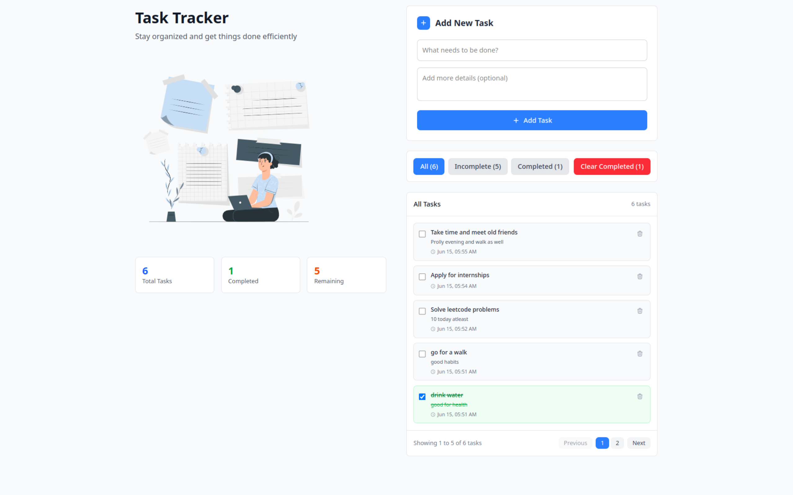

## Task Tracker App

A clean and modern task management application built with React and Vite for organizing daily tasks and todos.


*Desktop/Laptop interface with dual-column layout*

How to Run

1. Clone the repository

2. Install dependencies:
   `npm install`

3. Start the development server:
   `npm run dev`

4. Open your browser and visit `http://localhost:5173`

### Project Overview

Core Features
- Task List UI with title, description, and completed checkbox
- Add new task form with title and description inputs  
- Delete task functionality with individual delete buttons
- Filter tasks by All, Completed, and Incomplete status
- Toggle task completion status by clicking checkboxes
- Timestamps for each task showing creation date and time
- localStorage persistence - tasks saved between browser sessions
- Additional features: pagination, task statistics, clear completed tasks

Technical Approach

Component Structure
The app follows a clean component hierarchy:

- App.jsx - Main container with state management and layout
- Components
  - TaskForm.jsx - Handles new task creation with form validation
  - FilterButtons.jsx - Manages task filtering and bulk actions
  - TaskList.jsx - Container for task display with pagination
  - TaskItem.jsx - Individual task rendering with interactions

Custom Hooks
- useTasks.js - Centralizes all task-related state logic and localStorage operations

State Management Strategy
- Task data managed through custom hook with localStorage sync
- Filter state maintained in main App component
- Form state handled locally within TaskForm component
- Pagination state for better UX with large task lists

Key Features

1. Responsive Design - Works seamlessly on desktop and mobile devices
2. Dual Layout - Desktop shows illustration alongside task management
3. Pagination - Displays 5 tasks per page to prevent scrolling issues
4. Statistics - Shows total, completed, and remaining task counts
5. Persistent Storage - Tasks automatically saved to browser localStorage
6. Visual Feedback - Clear indicators for completed vs incomplete tasks
7. Bulk Actions - Clear all completed tasks at once

File Structure

```bash
src/
├── components/
│   ├── FilterButtons.jsx    # Task filtering and bulk actions
│   ├── TaskForm.jsx         # New task creation form
│   ├── TaskItem.jsx         # Individual task display
│   └── TaskList.jsx         # Task container with pagination
├── hooks/
│   └── useTasks.js          # Custom hook for task management
├── App.jsx                  # Main application component
├── main.jsx                 # React app entry point
└── index.css                # Tailwind CSS imports

```

Development Decisions

Why This Architecture?
- Component Composition: Each component has a single responsibility
- Props vs State: Clear distinction between local and shared state
- Performance: Pagination prevents rendering large lists

localStorage Implementation
- Tasks are automatically saved to browser storage and restored on app load, with proper error handling for storage issues.

Styling Approach
- Used Tailwind CSS for rapid development with clean, professional appearance. Focused on usability over complex animations.
